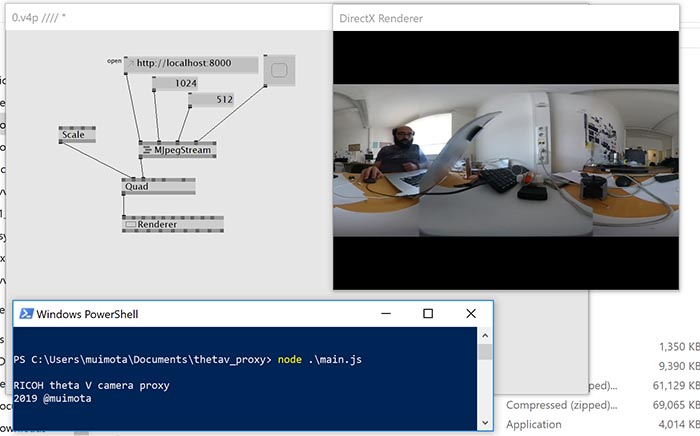

# RICOH Theta V direct mode httpProxy

This is a proxy to grab the livePreview in a simple way for theta V in directmode.
Runs in [Node](http://nodejs.org) without any dependency, it should run all platforms that node can be installed
There is no need to install any plugin in the camera
The mjpeg stream is 1024x512  
Only one device can be connected at once

## instructions

* Put camera in direct mode (blue wifi light)
* Connect the computer to the camera's AP
* run the script `node main.js`

## View the stream

* Browser to `http://127.0.0.1:8000` [Chorme](http://www.google.com/chrome) and [Firefox](http://firefox.org) suported
* In [VLC](https://www.videolan.org/index.html) open `http://127.0.0.1:8000` It has a delay due the VLC buffering
* In [gstreamer](https://gstreamer.freedesktop.org/)`gst-launch-1.0 -v souphttpsrc location=http://127.0.0.1:8000 ! decodebin ! autovideosink`
* The stream can be used in [vvvv](https://vvvv.org/) with the [MJPEGStream](https://vvvv.org/documentation/mjpegstream-%28ex9.texture-receiver%29) component.
